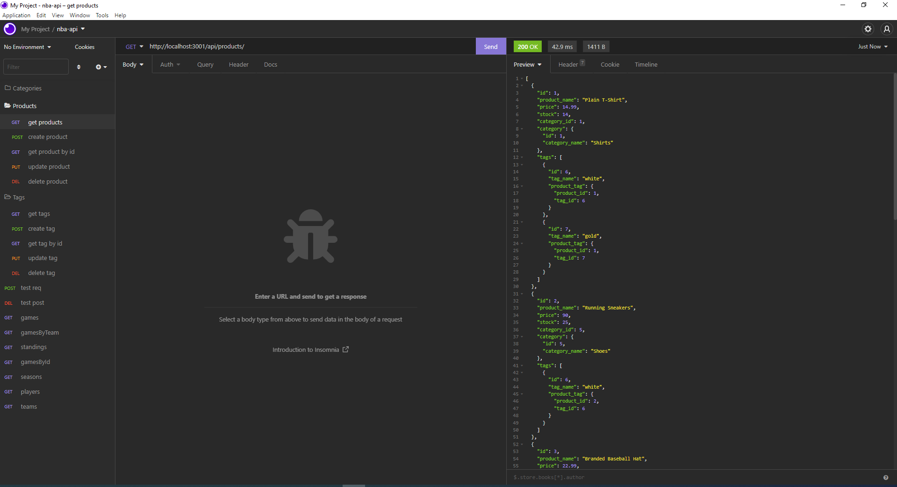

# ORM-Backend
A back end for an e-commerce site using an Express.js API to use Sequelize to interact with a MySQL database.
## Table of Contents
* [Installation](#installation)
* [Usage](#usage)
* [Features](#features)
* [Technology](#technology)
* [License](#license)
* [Screenshot](#screenshot)
* [Repository](#repository-httpsgithubcomdpmurphy11orm-backend)
* [Demo Videos](#questions)
* [Questions](#questions)
## Installation
  To install the project dependencies, run the following command:
  ```
  npm i
  ```
## Usage
  To run the program, enter the following command:
  ```
  npm start
  ```
## Features
```md
GIVEN a functional Express.js API
WHEN the user adds the database name, MySQL username, and MySQL password to an environment variable file
THEN the user is able to connect to a database using Sequelize
WHEN the user enters schema and seed commands
THEN a development database is created and is seeded with test data
WHEN the user enters the command to invoke the application
THEN the server is started and the Sequelize models are synced to the MySQL database
WHEN the user opens API GET routes in Insomnia for categories, products, or tags
THEN the data for each of these routes is displayed in a formatted JSON
WHEN the user tests API POST, PUT, and DELETE routes in Insomnia
THEN the user is able to successfully create, update, and delete data in the database
```
## Technology
```md
* Node.js
* MySQL2 package
* Template literals
* Express.js
* Sequelize package
* dotenv package
* Async Await
```
### License
[](https://github.com/dpmurphy11/ORM-Backend/blob/main/LICENSE)
### Screenshot

### Repository: <https://github.com/dpmurphy11/ORM-Backend>
### Demo Video 1: <https://drive.google.com/file/d/1fULD3f36gejxr774et23Djcyyq684XZI/view?usp=sharing>
### Demo Video 2: <https://drive.google.com/file/d/1RGYMaB3e4EJCjqhqweKQzPcJWJMo4XQ8/view?usp=sharing>
### Questions
  If you have any questions about the repo, open an issue or contact me at dpmurphy_onsite@hotmail.com
  Visit my GitHub profile at [dpmurphy11](https://github.com/dpmurphy11/).
